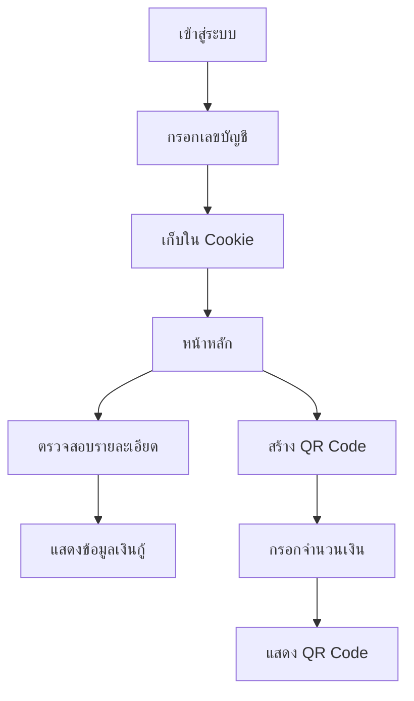

# 🏦 GHB Profile - ระบบจัดการบัญชีเงินกู้

เว็บแอปพลิเคชันสำหรับตรวจสอบรายละเอียดบัญชีเงินกู้และสร้าง QR Code สำหรับการชำระเงิน ผ่าน GH Bank API

[](https://kit.svelte.dev/)
[](https://tailwindcss.com/)
[](https://vercel.com/)

## ✨ Features

- 🔐 **Cookie-based Authentication** - ระบบยืนยันตัวตนด้วย Cookie (30 วัน)
- 📊 **รายละเอียดบัญชีเงินกู้** - ดูข้อมูลยอดค้างชำระ, เงินต้น, ดอกเบี้ย
- 💳 **สร้าง QR Code** - สร้าง QR Code สำหรับชำระเงินด้วย PromptPay
- 🎨 **Responsive Design** - ใช้งานได้ทั้งมือถือและคอมพิวเตอร์
- 🚀 **Server-side API Proxy** - แก้ปัญหา CORS ด้วย SvelteKit API routes
- 🌏 **Optimized for Asia** - Deploy บน Vercel Singapore region

## 🛠 Tech Stack

- **Framework**: [SvelteKit 2.43](https://kit.svelte.dev/) (Svelte 5)
- **Styling**: [Tailwind CSS 4](https://tailwindcss.com/) + [DaisyUI 5](https://daisyui.com/)
- **Language**: TypeScript 5.9
- **Build Tool**: Vite 7
- **Package Manager**: pnpm
- **Deployment**: Vercel (Node.js 20.x)

## 📁 Project Structure

```
my-ghb-profile/
├── src/
│   ├── routes/
│   │   ├── access/          # หน้าเข้าสู่ระบบ (กรอกเลขบัญชี)
│   │   ├── home/            # หน้าหลัก (เมนูหลัก)
│   │   ├── loan-details/    # หน้าแสดงรายละเอียดเงินกู้
│   │   ├── generate-qr/     # หน้าสร้าง QR Code
│   │   └── api/
│   │       ├── loan-details/+server.ts  # API Proxy สำหรับดึงข้อมูลเงินกู้
│   │       └── generate-qr/+server.ts   # API Proxy สำหรับสร้าง QR Code
│   ├── app.html             # HTML template
│   ├── app.css              # Global styles
│   └── app.d.ts             # TypeScript declarations
├── static/                  # Static assets
├── svelte.config.js         # SvelteKit configuration
├── vite.config.ts           # Vite configuration
├── vercel.json              # Vercel deployment config
└── package.json

```

## 🚀 Getting Started

### Prerequisites

- Node.js 20.x or higher
- pnpm (or npm/yarn)

### Installation

```bash
# Clone the repository
git clone https://github.com/alalearl/my-ghb-profile.git
cd my-ghb-profile

# Install dependencies
pnpm install

# Start development server
pnpm dev

# Open http://localhost:5173
```

### Development

```bash
# Start dev server
pnpm dev

# Start dev server with auto-open browser
pnpm dev -- --open

# Run type checking
pnpm check

# Run linter
pnpm lint

# Format code
pnpm format
```

### Building for Production

```bash
# Build the application
pnpm build

# Preview production build locally
pnpm preview
```

## 🌐 Deployment

โปรเจกต์นี้พร้อมสำหรับ deploy บน Vercel แล้ว ดูคู่มือละเอียดได้ที่ [DEPLOY.md](./DEPLOY.md)

### Quick Deploy

1. **Push to GitHub**
   ```bash
   git remote add origin YOUR_REPO_URL
   git push -u origin main
   ```

2. **Deploy to Vercel**
   - ไปที่ https://vercel.com/new
   - Import repository
   - Click Deploy!

หรือใช้ Vercel CLI:
```bash
npm i -g vercel
vercel --prod
```

## 📖 API Integration

แอปพลิเคชันนี้เชื่อมต่อกับ GH Bank API ผ่าน server-side proxy:

### API Endpoints

#### 1. Loan Details API
```
POST /api/loan-details
```
- ดึงข้อมูลรายละเอียดบัญชีเงินกู้
- Proxy to: `https://apiplatform.ghbank.co.th/genqr/GenQR/VerifyAccountByQRNoSSN`

#### 2. Generate QR Code API
```
POST /api/generate-qr
```
- สร้าง QR Code สำหรับชำระเงิน
- Proxy to: `https://apiplatform.ghbank.co.th/genqr/GenQR/QRGenerateAndTransaction`

## 🎯 User Flow



## 🎨 Features Overview

### 1. Authentication (Cookie-based)
- เก็บเลขบัญชีใน cookie นาน 30 วัน
- ไม่ต้อง login ซ้ำ
- Auto-redirect ถ้าไม่มี cookie

### 2. Loan Details
- แสดงชื่อลูกค้า (ไทย/อังกฤษ)
- แสดงเลขที่บัญชีเงินกู้
- แสดงยอดคงเหลือ, เงินต้น, ดอกเบี้ย, ค่าธรรมเนียม
- รีเฟรชข้อมูลได้

### 3. QR Code Generation
- Auto-fill จำนวนเงินจากยอดชำระ
- เลือกชื่อ ไทย/อังกฤษ
- แสดง QR Code แบบ inline
- สร้าง QR Code ใหม่ได้

## 🔧 Configuration

### Vercel Settings
- Runtime: Node.js 20.x
- Region: Singapore (sin1)
- Framework: SvelteKit
- Build Command: `pnpm run build`

### Environment Variables
ไม่มี environment variables ที่จำเป็นในตอนนี้ แต่สามารถเพิ่มได้ใน `.env.local`:

```env
# ตัวอย่าง (ถ้าต้องการ)
PUBLIC_API_URL=https://api.example.com
```

## 📱 Screenshots

### หน้าเข้าสู่ระบบ
กรอกเลขที่บัญชีเงินกู้เพื่อเข้าใช้งาน

### หน้าแสดงรายละเอียด
แสดงข้อมูลเงินกู้ ยอดคงเหลือ และรายละเอียดการชำระ

### หน้าสร้าง QR Code
สร้าง QR Code สำหรับชำระเงินผ่าน PromptPay

## 🤝 Contributing

Contributions are welcome! Feel free to submit issues and pull requests.

## 📝 License

This project is open source and available under the [MIT License](LICENSE).

## 👨‍💻 Author

**Earl Kisra**
- GitHub: [@alalearl](https://github.com/alalearl)

## 🙏 Acknowledgments

- [SvelteKit](https://kit.svelte.dev/)
- [Tailwind CSS](https://tailwindcss.com/)
- [DaisyUI](https://daisyui.com/)
- [Vercel](https://vercel.com/)
- GH Bank API Platform

---

Made with ❤️ using SvelteKit
